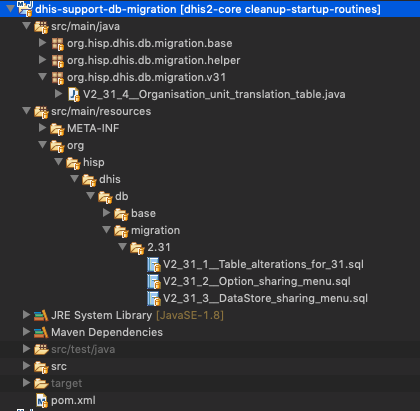

## Dhis2 Database Migration Guidelines (V2.31+)
### Flyway

Starting from version 2.31, DHIS2 will be leveraging [flyway](https://flywaydb.org/documentation/) for database migrations. 
Flyway is an open-source database migration tool. 

Some of the relevant/interesting sections of flyway documentations for dhis2 developers are
1. [How Flyway works](https://flywaydb.org/getstarted/how)
2. [Versioned Migrations](https://flywaydb.org/documentation/migrations#versioned-migrations)
3. [Sql based Migrations](https://flywaydb.org/documentation/migrations#sql-based-migrations)
4. [Java Based Migrations](https://flywaydb.org/documentation/migrations#java-based-migrations)


### Dhis2 Support Db Migration Module

The maven project _dhis2-support-db-migration_ under _dhis2-support_ is responsible for handling flyway migrations in dhis2. It contains flyway configurations and  all migration scripts. 
Migration Scripts can be defined both in Java classes or in sql files. Most of the upgrade/migration scripts would ideally fit in _.sql_ files. But in case there is more complex migrations, Java classes can be the way to go.

The location where flyway searches for migration scripts will be `org/hisp/dhis/db/migration` Therefore all classes (and subpackages) under `org.hisp.dhis.db.migration.*` will be scanned for java based migrations. Likewise, all sql files in resources under the path `org/hisp/dhis/db/migration/*` will also be scanned.   

Here is a snapshot of how the dhis2-support-db-migration project looks like.



### Hibernate Configuration Changes 
Hibernate `hbm2ddl` will always be set to `validate`. Users will not be able to override this setting anymore (using the `connection.schema` property in _dhis.conf_). 
This also means that when we modify any hbm xml files, we also need to take care of the corresponding DDL scripts ourselves using flyway.
However, since our unit tests are going to be run on H2 , flyway will be disabled for unit tests, and we will let hibernate create the schema i.e `hbm2ddl` will be set to _create_ only for unit tests.


### Development Guidelines

- The naming is of the format `V<Major>_<Minor>_<Patch>__<Description_separated_by_underscores>`. 
	Eg: V2_31_1__Table_alterations_for_adding_sharing_properties_to_Datastore.sql
V2_31_2__Upgrading_Scheduler_to_change_jobparameters_column_to_jsonb.java
Please use sensible descriptions separated by underscores for spaces and refrain from using camel cases for multiple words. Thumb rule : Think from a db admin perspective, and ensure the description is self explanatory.

- We may have multiple migration scripts (as sql files or java classes) for a single release. For eg: 2.31.1 , 2.31.2,........, 2.31.100. Developers can decide whether they need to _append_ their migrations to an already existing migration file (Say V2.31.1) or they can create a new migration file (V2.31.2). In most cases, it is ideal to create new migration file for your changes, by picking up the next unused integer for the patch version. 

- Always use lower case for sql scripts added into .sql files.

- From 2.31, the database will always have a function named _generate_uid()_  for generating uids. Reuse this function for all future versions.

- Transactions and sql connection resource handlings are done by flyway. Refrain from explicitly beginning/commiting transactions in sql migration scripts. Also refrain from explicitly closing connections in java  migration scripts.

- All migration scripts should be made idempotent as much as possible. Scripts should also consider that it could be executed on a  fresh db (with no data). Idempotency in most cases simply means using the IF NOT EXISTS / IF EXISTS wherever possible. For constraints with explicit names, when modifying them, its also advised to drop the constraint (if exists) first and then create the constraint which ensures the scripts are rerunnable without any side effects. _In a highly unlikely event_ of having to write a migration script that cannot be made idempotent in a clean way, just add a comment on top of them and leave them _non-idempotent_ . These would help other developers (if required) to manually undo those migrations during debugging (or they could simply curse you and load a fresh database to start over again :laughing: ).

- Set the configuration property ```flyway.migrate_out_of_order``` to *true* in `dhis.conf`. It ensures that if version 2.31.1 and version 2.31.3 are already installed, but the latest build has version 2.31.2, then it tries to apply that too. This is useful for development instances.


### Flyway Schema History Table
_flyway_schema_history_ table looks like this


|installed_rank | version | description | type | script | checksum | installed_by | installed_on | execution_time | success
|--|--|--|--|--|--|--|--|--|--|
| 1 | 2.30.0 | Populate dhis2 schema if empty database | JDBC | org.hisp.dhis.db.migration.base.V2_30_0__Populate_dhis2_schema_if_empty_database |  | dhis | 2018-11-01 13:21:06.770871 | 5004 | true |
| 2 | 2.31.1 | Table alterations for 31 | SQL | 2.31/V2_31_1__Table_alterations_for_31.sql | -1758192732 | dhis | 2018-11-01 13:21:06.781845 | 31 | true |
| 3 | 2.31.2 | Option sharing menu | SQL | 2.31/V2_31_2__Option_sharing_menu.sql | 1231089097 | dhis | 2018-11-01 13:21:06.818149 | 10 | true |
| 4 | 2.31.3 | DataStore sharing menu | SQL | 2.31/V2_31_3__DataStore_sharing_menu.sql | -26438716 | dhis | 2018-11-01 13:21:06.832763 | 9 | true |
| 5 | 2.31.4 | Sample java based migration | JDBC | org.hisp.dhis.db.migration.v31.V2_31_4__Sample_java_based_migration |  | dhis | 2018-11-01 13:21:06.846571 | 0 | true |
| 6 | 2.31.5 | Create chart yearlyseries table | SQL | 2.31/V2_31_5__Create_chart_yearlyseries_table.sql | -963276479 | dhis | 2018-11-01 13:21:06.850797 | 4 | true |

### FAQs
1. _Error : FlywayException: Validate failed: Migration description mismatch for migration version 2.30.0_

*Reason*: This is because a previous war had already executed the migration v2.30.0 (either java or sql based). Your current war has the same version, but the description has changed. In short, the migration file name has been renamed since your previous deployment.

*Possible quick resolution*: Delete the failing version row from flyway_schema_history table and start your application again. 

2. _Error : FlywayException: Validate failed. Found differences between applied migrations and available migrations: Migration Checksum mismatch for migration V2_31_3__Jsonb_changes.sql_

*Reason*: This is because a previous war had already executed the migration v2.31.3 (sql based). Your current war has the same version, but the content of the migration file has changed. In short, the migration file content has been modified since your previous deployment.

*Possible quick resolution*: Delete the failing version row from flyway_schema_history table and start your application again. 

3. _Error : Syntax error at or near "NOT"_

*Reason*: Your postgres version is lower than the required 9.6.

*Resolution*: Upgrade your postgres to version 9.6 or higher.

4. _Error : You can't operate on a closed Connection!!!_


*Reason*: In you java migration class, you have explicitly closed the connection.

*Resolution*. Do not close the connection. Do not use _try with resources_ on the connection object (which closes the connection at the end of try).

5. _Error : Schema-validation: missing column [uid] in table [relationship]_


*Reason* : Hibernate does the schema validation after flyway has migrated the db. This error means that there are some changes in some of the hbm.xml files, but the same has not been applied through flyway scripts. 

*Resolution* : Add the corresponding _alter table_ statements into a new(or existing) flyway migration script file.

*Note*: Appending scripts to an already existing script (which may already have been applied to the db you are working), will have some consequences for development instances. On those instances, flyway validates whether there is any checksum mismatches(file changes) and fails. If flyway fails because of a latest pull of other developers work (or your own work) which has modified one of the installed scripts, you can explicitly delete the row with ```DELETE from flyway_schema_history where installed_rank=4``` and then restart your application. Flyway then considers the script as an uninstalled version and proceeds to apply that script. For this reasons, in development instances you need to have [_flyway outOfOrder_](https://flywaydb.org/documentation/commandline/migrate#outOfOrder) setting to true. This can be done by setting the configuration property ```flyway.migrate_out_of_order``` to *true* in `dhis.conf`.  In case deleting the record also does not work, then you may have to start with a fresh demo db again.


