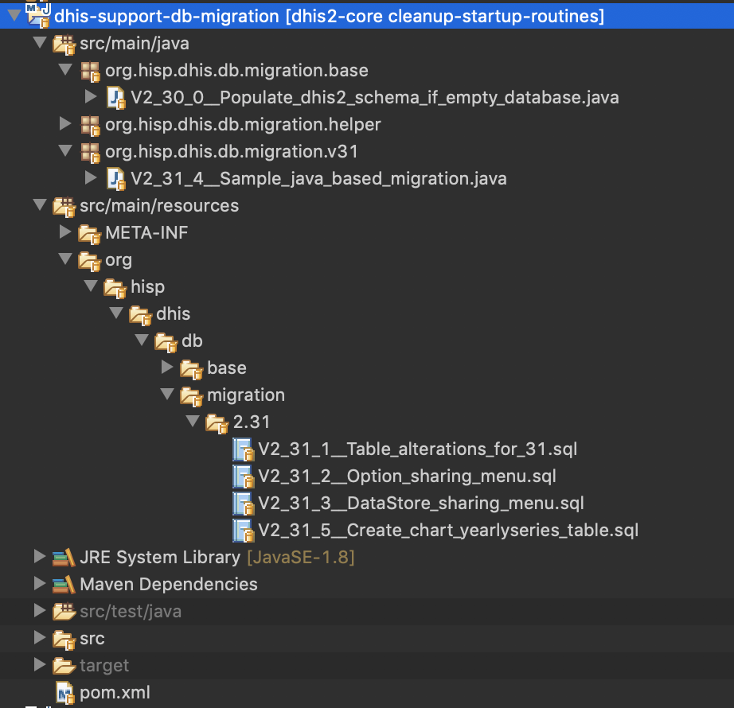

## Dhis2 Database Migration Guidelines (V2.31+)
### Flyway

Starting from version 2.31, DHIS2 will be leveraging [flyway](https://flywaydb.org/documentation/) for database migrations. 
Flyway is an open-source database migration tool. 

Some of the relevant/interesting sections of flyway documentations for dhis2 developers are
1. [How Flyway works](https://flywaydb.org/getstarted/how)
2. [Versioned Migrations](https://flywaydb.org/documentation/migrations#versioned-migrations)
3. [Sql based Migrations](https://flywaydb.org/documentation/migrations#sql-based-migrations)
4. [Java Based Migrations](https://flywaydb.org/documentation/migrations#java-based-migrations)


### Dhis2 Support Db Migration Module

The maven project _dhis2-support-db-migration_ under _dhis2-support_ is responsible for handling flyway migrations in dhis2. It contains flyway configurations and  all migration scripts. 
Migration Scripts can be defined both in Java classes or in sql files. Most of the upgrade/migration scripts would ideally fit in _.sql_ files. But in case there is more complex migrations, Java classes can be the way to go.

The location where flyway searches for migration scripts will be `org/hisp/dhis/db/migration` Therefore all classes (and subpackages) under `org.hisp.dhis.db.migration.*` will be scanned for java based migrations. Likewise, all sql files in resources under the path `org/hisp/dhis/db/migration/*` will also be scanned.   


### Hibernate Configuration Changes 
Hibernate `hbm2ddl` will always be set to `validate`. Users will not be able to override this setting anymore (using the `connection.schema` property in _dhis.conf_). 
This also means that when we modify any hbm xml files, we also need to take care of the corresponding DDL scripts ourselves using flyway.
However, since our unit tests are going to be run on H2 , flyway will be disabled for unit tests, and we will let hibernate create the schema i.e `hbm2ddl` will be set to _create_ only for unit tests.


### Development Guidelines

Here is a snapshot of how the dhis2-support-db-migration project looks like.


The naming is of the format `V<Major>_<Minor>_<Patch>__<Description_separated_by_underscores>`. 
	Eg: V2_31_1__Table_alterations_for_adding_sharing_properties_to_Datastore.sql
		V2_31_2__Upgrading_Scheduler_to_change_JobParameters_to_jsonb.java

We can have multiple migration scripts (as sql files or java classes) for a single release. For eg: 2.31.1 , 2.31.2,........, 2.31.100

Developers can decide whether they need to _append_ their migrations to an already existing migration file (Say V2.31.1) or they can create a new migration file (V2.31.2). 

*Note*: Appending scripts to an already existing script (which is already applied), will have some consequences for development instances. On the instances on which that particular script (say V2.31.5.sql) was already executed, flyway validates whether there is any checksum mismatches(file changes) and fails. One of the many solutions when this happens, is to simply delete the particular record for that scripts from _flyway_schema_history_ table and restart the application. Flyway then considers the script as an uninstalled version and proceeds to apply that script. For development instances it is also recommended to have [_flyway outOfOrder_](https://flywaydb.org/documentation/commandline/migrate#outOfOrder) setting to true. This can be done by setting the configuration property ```flyway.migrate.out.of.order``` to *true* in `dhis.conf`. OutOfOrder is recommended only for development instances. It ensures that if version 2.31.1 and version 2.31.3 are already installed, but the latest build has version 2.31.2, then it tries to apply that too. 

All migration scripts should be made idempotent if possible. Scripts should also consider that it could be executed on a  fresh db (with no data). Idempotency in most cases simply means using the IF NOT EXISTS / IF EXISTS wherever possible. For constraints with explicit names, its also advised to drop the constraint (if exists) first and then create the constraint which ensures the scripts are rerunnable without any side effects.

