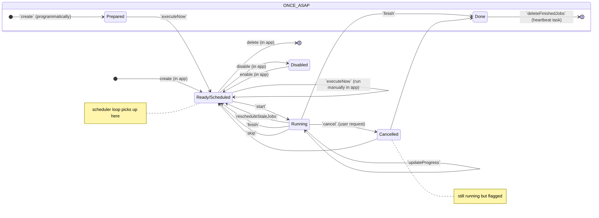

## State Diagram

OBS! 
* transition to disable and delete can apply in any state but is only shown from `Ready/Scheduled`
* `Cancelled` is identical to `Running` except it cannot transition to `Cancelled` any more (not all transtions are shown for simplicity)

| State | `jobState` | `schedulingType` | Other conditions |
|--|--|--|--|
| `Prepared` | `NOT_STARTED` | `ONCE_ASAP` | |
| `Ready/Scheduled` | `SCHEDULED` | * | |
| `Running` | `RUNNING` | * | |
| `Cancelled` | `RUNNING` | * | `cancel = true` |
| `Done` | `DISABLED` | `ONCE_ASAP` | `lastFinished != null` |
| `Disabled` | * | * | `enabled = false` |
