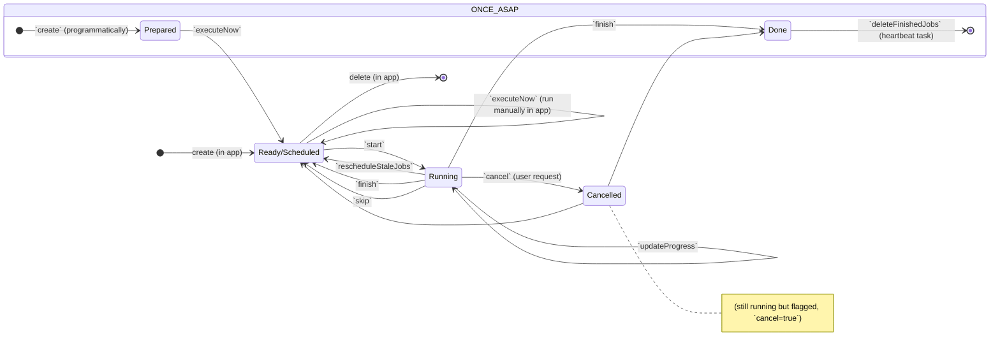

```mermaid
stateDiagram-v2
direction LR
state ONCE_ASAP {
  [*] --> Prepared: `create` (programmatically)
  Done --> [*]: `deleteFinishedJobs` (heartbeat task)
}
[*] --> Ready/Scheduled: create (in app)
Prepared --> Ready/Scheduled: `executeNow`
Ready/Scheduled --> Ready/Scheduled: `executeNow` (run manually in app)
Ready/Scheduled --> Running: `start`
Ready/Scheduled --> [*]: delete (in app)
Running --> Done: `finish`
Running --> Running: `updateProgress`
Running --> Ready/Scheduled: `rescheduleStaleJobs`
Running --> Ready/Scheduled: `finish`
Running --> Ready/Scheduled: `skip`
Running --> Cancelled: `cancel` (user request)
Cancelled --> Done
Cancelled --> Ready/Scheduled
note right of Cancelled: (still running but flagged, `cancel=true`) 
```
