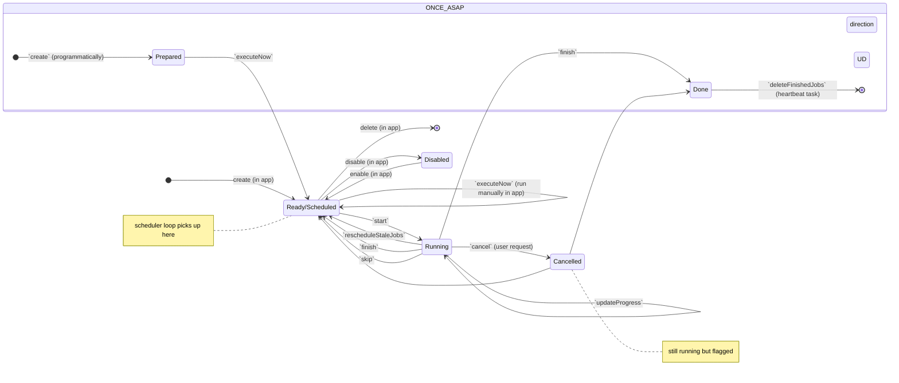

## State Machine
Jobs in the scheduling process move between different states. 
The main indicator for the state a job is in is the `jobStatus` type but a few other fields also have an influence on the state.

OBS! 
* transition to disable and delete can apply in any state but is only shown from `Ready/Scheduled`
* `Cancelled` is identical to `Running` except it cannot transition to `Cancelled` any more (not all transtions are shown for simplicity)
* `skip` transition affects other job configurations

| State | `jobStatus` | `schedulingType` | Other conditions |
|--|--|--|--|
| `Prepared` | `NOT_STARTED` | `ONCE_ASAP` | |
| `Ready/Scheduled` | `SCHEDULED` | * | |
| `Running` | `RUNNING` | * | |
| `Cancelled` | `RUNNING` | * | `cancel = true` |
| `Done` | `DISABLED` | `ONCE_ASAP` | `lastFinished != null` |
| `Disabled` | * | * | `enabled = false` |

| Transition | From | To | Actor |
|--|--|--|--|
| `create`   | - | `Prepared` | user via other endpoints (async function) |
| `executeNow` | `Prepared` | `Ready/Scheduled` | user via other endpoints (async function) |
| `executeNow` | `Ready/Scheduled` | `Ready/Scheduled` | user via scheduler app or API |
| `start`    | `Ready/Scheduled` | `Running` | scheduler loop |
| `updateJobProgress` | `Running` | `Running` | task executor thread |
| `finish`   | `Running`/`Cancelled` | `Ready/Scheduled`/`Done` | task executor thread |
| `rescheduleStateJobs` | `Running`/`Cancelled` | `Ready/Scheduled` | heartbeat job |
| `canel` | `Running` | `Cancelled` | user request cancellation via app or API |
| `deleteFinishedJobs` | `Done` | (deleted) | heartbeat job |
| `skip` | `Ready/Scheduled` | `Ready/Scheduled` | task executor thread (of another job configuration in the same queue) |
