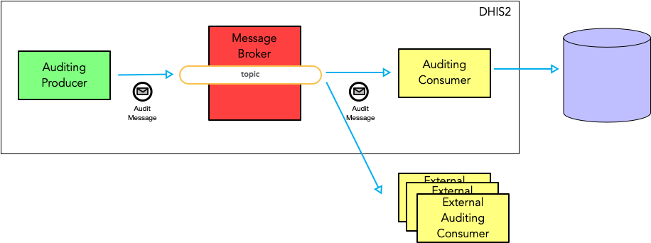
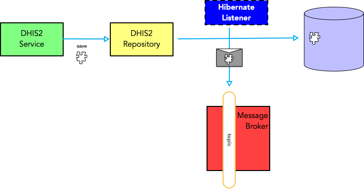

# DHIS2 Auditing

Auditing is the process of recording domain-level events: a user logs in, an object is created, an action is performed.
The event is recorded with additional information that is used to answer questions like, "who did this?", "when the action was performed" and possibly "why?".

## Legacy auditing in DHIS2

DHIS2 has an auditing sub-system which is based on a number of specialized Auditing services that synchronously persist Audit entities to the database. The Audit entities are modeled around the entity they audit (e. g. [ProgramInstanceAudit](https://github.com/dhis2/dhis2-core/blob/667efb56e42659569e5904d92c492f57e6a4c7ea/dhis-2/dhis-api/src/main/java/org/hisp/dhis/program/ProgramInstanceAudit.java#L47)).

The invocation of the _ad-hoc_ Auditing Services is executed directly by the business logic that is performing the audited action. 
For instance, the function that creates a new Program Instance is also responsible to invoke the [ProgramInstanceAuditService](https://github.com/dhis2/dhis2-core/blob/653fee433105a227867a1877aaaa1a52a89579c1/dhis-2/dhis-services/dhis-service-core/src/main/java/org/hisp/dhis/program/DefaultProgramInstanceAuditService.java#L44).

## Asynchronous auditing architecture

A new, more performant solution has been introduced in `DHIS2 2.34`. The solution is based on a "fire-and-forget", Publish-Subscribe, non-blocking paradigm.
The auditing of events is executed in a separate thread from the main "business" thread to reduce the performance hit required to persist the auditing entry.
The new auditing subsystem leverages [Apache ActiveMQ Artemis](https://activemq.apache.org/components/artemis/) as a message broker. Artemis has been part of DHIS2 since 2.31.

Auditing messages are pushed into auditing PubSub Topics and persisted asynchronously by specialized Message Consumers. Each consumer is responsible for persisting (or ignoring) an Audit message.

Artemis exposes a [JMS client facade](https://activemq.apache.org/components/artemis/documentation/2.0.0/using-jms.html) that is used by DHIS2 to push messages into the Auditing topics and by "internal" message consumers to consume the messages.
Additionally, external clients can connect to the broker using the [AMPQ protocol](https://activemq.apache.org/components/artemis/documentation/2.0.0/using-amqp.html) and consumes messages from the Auditing topics.

## Audit event capturing

A design goal of the new auditing architecture is to remove as much as possible Auditing-specific logic from the main business flow. In other words, Auditing becomes a _cross-cutting concern_ (such as logging, security or transactions) within DHIS2. Since DHIS2 uses Hibernate for the majority of DB-related operations, [Hibernate Entity Listeners](https://docs.jboss.org/hibernate/orm/5.4/userguide/html_single/Hibernate_User_Guide.html#events-events) can be used to intercept read or write operation against domain entities and trigger an auditing event whenever an entity is created, updated, deleted or fetched.

Audit-specific Hibernate listeners have the responsibility to capture Hibernate-managed entities *after* the entity has been saved to the data store and, based on some rules, wrap the entity into an Audit message and invoke the message producer.

Audit listeners for `Insert`, `Update`, `Delete` and `Load` operations are located in the package: `org.hisp.dhis.artemis.audit.listener` in the `dhis-support-artemis` module.

## Audit message

There is only one type of Audit message: `org.hisp.dhis.artemis.audit.Audit`. This object must be constructed before sending a message and the entity to audit has to be injected into the message.

An Audit message has the following properties:

| attribute    | name                                                             |
|--------------|------------------------------------------------------------------|
| `auditType`  | type of auditing operation (insert, update, etc.)                |
| `auditScope` | "domain" of auditing (Metadata, Tracker, etc.)                   |
| `createdAt`  | audit object creation timestamp                                  |
| `createdBy`  | audit object creation user (either the logged-in user or system) |
| `klass`      | the name of the class getting audited                            |
| `uid`        | the UID of the entity getting audited                            |
| `code`       | the code of the entity getting audited                           |
| `data`       | the entity to be audited                                         |

## Audit message protocol

All audit messages are serialized to JSON before being published: this is required for compatibility with external consumers.
Serialization is carried out using the Jackson framework.

Internal message consumers must de-serialize the messages (from Json) prior to extracting the payload and persisting it.

## Auditing rules

The Hibernate Event Listeners must be able to define if the intercepted entity must be wrapped into an `Audit` message and shipped to the Auditing topic.
This is achieved by annotating the entities we wish to audit with the `org.hisp.dhis.audit.Auditable` annotation.

This annotation can be placed on concrete classes or superclasses. When an entity is intercepted and its class or super-class is annotated with `@Auditable` the Auditing framework will inject the entity into the Auidt message and publish it to the relevant topic.

## Auditing topics

JMS topis are created at system start and are mapped to the "Audit Scope" of each message.
Currently, the topics are created as non-durable 

## Legacy factory

Since DHIS2 already uses Auditing objects, the reccomended way to build these objects is through the `AuditLegacyObjectFactory` interface. Eventually, the legacy Auditing objects will be replaced by a single foreign-key-less Auditing object.

