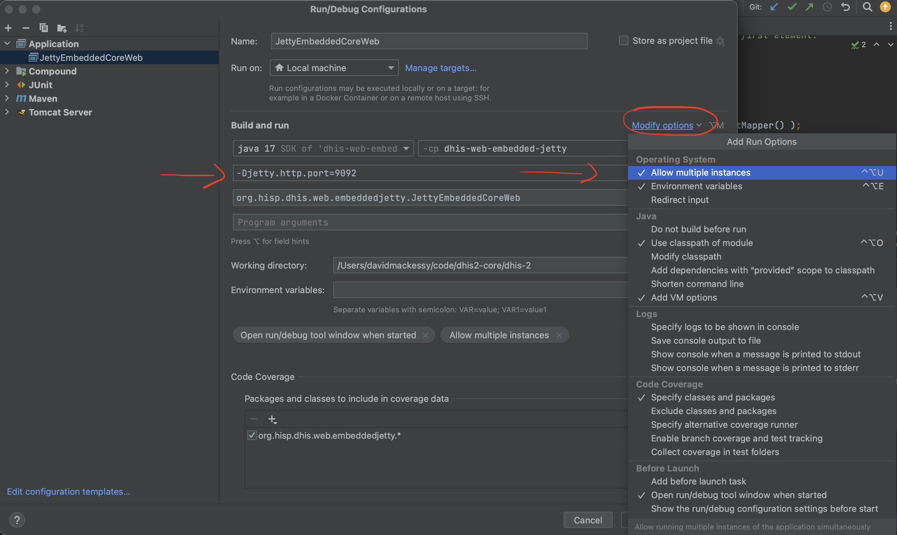

# Local DHIS2 API Cluster with Redis and Nginx

The DHIS 2 backend API can be built as a JAR file and deployed with an embedded Jetty server for rapid development and testing. Multiple nodes can be run at the same time to form a cluster. For details on running with embedded Jetty see the [embedded Jetty guide](embedded_jetty.md).

> **Note**
>
> The official docs have a [cluster setup section](https://docs.dhis2.org/en/manage/performing-system-administration/dhis-core-version-master/installation.html?h=redis+manage+master#install_web_server_cluster_configuration) also for reference.


## Prerequisites  

### Nginx

Nginx will be used to load balance requests to the running DHIS2 nodes.  
#### Steps to install and run

##### Mac

1. To install run `brew install nginx`
2. To find where the nginx conf file is located, run `nginx -t`
3. It should show something like `nginx: the configuration file /opt/homebrew/etc/nginx/nginx.conf syntax is ok`
4. Edit `nginx.conf` file to look like this:
   ```text
    events {}

    http {
   
        upstream dhis2_cluster {
            server localhost:9091;
            server localhost:9092;
        }

        server {
            listen 80;
            location / {
                proxy_pass http://dhis2_cluster;
            }
        }
    }
      ```
5. The relevant parts to note are:
   - `upstream dhis2_cluster` - this is the named group to proxy requests to
   - `server localhost:9091` this will be one of the DHIS2 nodes started locally
   - `server localhost:9092` this will be the other DHIS2 node started locally
   - `location` Which requests to map, `/` being all
   - `proxy_pass http://dhis2_cluster;` defines where the requests will be proxied to. This references the `upstream` property already set above

   For example, a call to `localhost/api/ping` will get mapped to `localhost:9091/api/ping` or `localhost:9092/api/ping`


6. Start nginx with the command `nginx`
7. To stop run `nginx -s stop`

### Redis

#### Steps to install and run

##### Mac

1. To install run `brew install redis`
2. To start run `redis-server`

### Postgres

Postgres will need to be up and running for DHIS2 to start normally. This is out of scope for this guide.

### DHIS2 conf

In the `dhis.conf` file add the required Redis config like so:
```text
# -------------
# Cluster
# -------------
redis.enabled = on

# Cache invalidation config
redis.cache.invalidation.enabled = on

# Shared Redis configuration
redis.host = 127.0.0.1
redis.port = 6379
#redis.password = PASSWORD (Optional, only if enabled on Redis server)
#redis.use.ssl = true (Optional, only if enabled on Redis server)
```

All DHIS2 nodes should use this config to connect to the same Redis server.

## Start cluster

With the prerequisites in place and running we can now start 2 DHIS2 nodes. There are multiple ways to do this but this guide will show the easiest and quickest way which is through Intellij.

### 1. Allow running of multiple instances of embedded Jetty

Open the Run configuration and allow running of multiple instances.  
This screenshot also shows where we can set the port for each of the DHIS2 nodes. Each instance should have its own port and should align with the Nginx upstream server settings [mentioned here](#nginx).



### 2. Start cluster nodes

1. Click the `Play` button to start the first node, making sure to pass in the desired port number for that node.
2. Click the `Play` button again to start the second node, making sure to pass in the desired port number for that node.

### 3. Test load balancing

#### Check Redis logs

If the Redis setup is working correctly, the app logs should contain these logs:  
`13:01:11.032  INFO [main] o.h.d.l.e.RedisLeaderManager: Setting up redis based leader manager with NodeUuid:da351f63-cb2e-4ba7-ab24-b7bc4afe9d7b and NodeID:`

`13:01:14.110  INFO [main] o.h.d.s.s.DefaultStartupRoutineExecutor: Executing startup routine [1 of 11, runlevel 1]: redisCacheInvalidationPreStartupRoutine`

`13:01:14.258  INFO [main] o.h.d.s.s.DefaultStartupRoutineExecutor: Executing startup routine [10 of 11, runlevel 20]: redisPreStartupRoutine`

#### Send API requests

Start sending in API requests as normal to the server using the endpoint `localhost` and observe how they are balanced between the nodes. The URL `localhost` is only required because of the previous config done with Nginx.  
For example, if you usually send requests locally during development to `localhost:9090/api/ping`, you would now use `localhost/api/ping`.