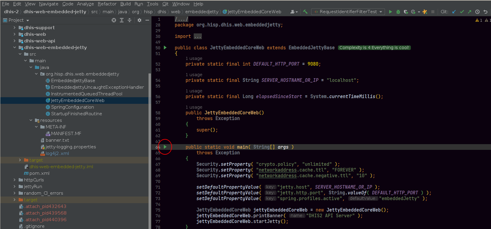
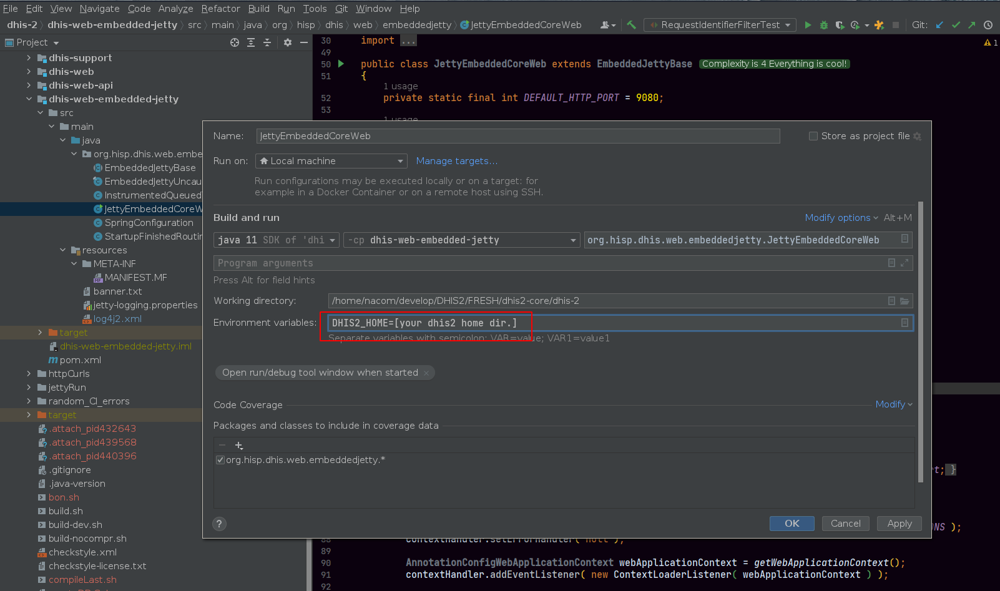
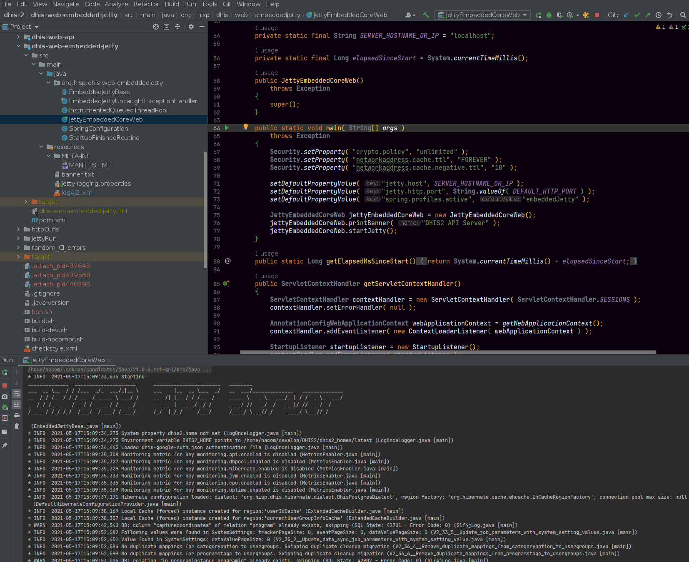

# DHIS2 API with Embedded Jetty 

The DHIS 2 backend API can be built as a JAR file and deployed with an embedded Jetty server for rapid development and testing.

## Quickstart

Build the JAR file and serve up the Jetty web server by running the provided script in the `dhis-2` directory:

```sh
./run-api.sh
```

This will make the API accessible at the following URL. Note that by browsing the API URLs in the browser, the browser will typically present a built-in authentication dialog.

```
http://localhost:9090/api/
```

## Compiling and starting an embedded Jetty container from the command line

The module called `dhis2-embedded-jetty` in the dhis2-core project is responsible for configuring and starting up an embedded Jetty container, and exposing the DHIS2 API on the default port which is `9090`.

Note that JDK 11 is required to run the API with the embedded Jetty server. Also note that no web apps will bee included in the build.

To skip the compile of the new `dhis2-embedded-jetty` module and get the same compile process as before you can do the following to exclude it from the build:

```sh
mvn clean install -Pdev -Pjdk11 -T 100C -pl -dhis-web-embedded-jetty
```

### Step 1: Compiling the DHIS2 core

From the root dhis2 directory, execute:

```sh
mvn clean install -Pdev -Pjdk11 -T 100C
```

### Step 2: Set DHIS2 home directory and run jar file

From the root dhis2 directory, execute:

```sh    
DHIS2_HOME=[your dhis2 home] \ 
java -jar ./dhis-web-embedded-jetty/target/dhis-web-embedded-jetty.jar
```

*TIP: You can also define the port and host/ip you want like this:*

```sh
java -Djetty.host=$HOST -Djetty.http.port=$PORT -jar ./dhis-web-embedded-jetty/target/dhis-web-embedded-jetty.jar
```

#### Alternative

The `run-api.sh` script will do exactly the same as above, but you will need to define your DHIS2_HOME first.

#### Step 1: Set DHIS2_HOME

From the root dhis2 directory, execute:

```sh
export DHIS2_HOME=[Your dhis2 home dir.]
```

#### Step 2: Run the bash script

From the root dhis2 directory, execute:

```sh
./run-api.sh
```
    
## Starting an embedded Jetty container from IntelliJ

You can also easily start the Jetty container directly from your IDE.

#### Step 1: Open JettyEmbeddedCoreWeb.java file
Open the JettyEmbeddedCoreWeb.java file in the "dhi2-web-embedded-jetty" module.

#### Step 2: Click the play button on the main method


#### Step 3: Edit run configuration
When clicking the play button, chose the last entry "Modify Run Configuration..."

#### Step 4: Add the DHIS2_HOME env var to the configuration


After setting the DHIS2_HOME variable, click "OK".

#### Step 5: Click play again and choose run or debug 


## Running embedded Jetty with front-end web apps

Starting from version 2.40, the embedded Jetty server supports serving the front-end web apps. As of January 2023, a developement/preview version of Struts-less front-end is built into the embedded Jetty module. You need to follow the instructions above in order to run the embedded Server with the front-end web apps. There are currently some caveats which will be resolved when all the front-end web apps have migrated to the new Struts-less backend. Mainly the password reset, self-registration and two-factor login are not supported in the development preview. Regular form/username password login is supported and is now the default redirect when accessing the server trough e.g. `http://localhost:9090/api`. There are some apps which are currently unsupported and will not work:

* Old data entry module
* Old tracker capture web app

See this PR for details: https://github.com/dhis2/dhis2-core/pull/12663

Follow progress on Jira epic: https://dhis2.atlassian.net/browse/DHIS2-14092
