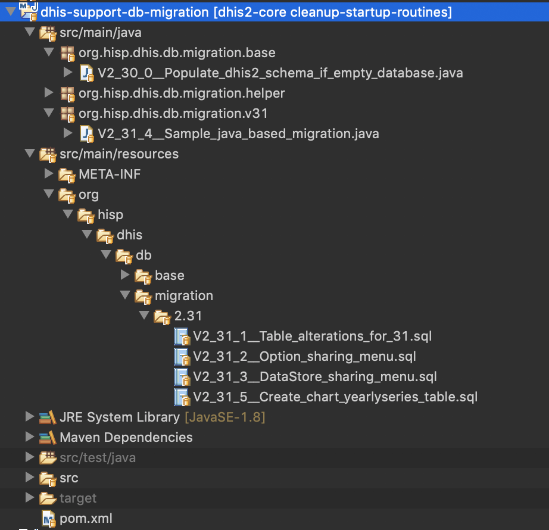

# Dhis2 Database Migration Guidelines (V2.31+)
## Flyway

Starting from version 2.31, DHIS2 will be leveraging [flyway](https://flywaydb.org/documentation/) for database migrations. 
Flyway is an open-source database migration tool. 

Some of the relevant/interesting sections of flyway documentations for dhis2 developers are
1. [How Flyway works](https://flywaydb.org/getstarted/how)
2. [Versioned Migrations](https://flywaydb.org/documentation/migrations#versioned-migrations)
3. [Sql based Migrations](https://flywaydb.org/documentation/migrations#sql-based-migrations)
4. [Java Based Migrations](https://flywaydb.org/documentation/migrations#java-based-migrations)


## Dhis2 Support Db Migration Module

The maven project _dhis2-support-db-migration_ under _dhis2-support_ is responsible for handling flyway migrations in dhis2. It contains flyway configurations and  all migration scripts. 
Migration Scripts can be defined both in Java classes or in sql files. Most of the upgrade/migration scripts would ideally fit in _.sql_ files. But in case there is more complex migrations, Java classes can be the way to go.

The location where flyway searches for migration scripts will be `org/hisp/dhis/db/migration` Therefore all classes (and subpackages) under `org.hisp.dhis.db.migration.*` will be scanned for java based migrations. Likewise, all sql files in resources under the path `org/hisp/dhis/db/migration/*` will also be scanned.   

Here is a snapshot of how the dhis2-support-db-migration project looks like.



## Hibernate Configuration Changes 
Hibernate `hbm2ddl` will always be set to `validate`. Users will not be able to override this setting anymore (using the legacy `connection.schema` property in _dhis.conf_). 
This also means that when we modify any hbm xml files, we also need to take care of the corresponding DDL scripts ourselves using flyway.
However, since our unit tests are going to be run on H2 , flyway will be disabled for unit tests, and we will let hibernate create the schema i.e `hbm2ddl` will be set to _create_ only for unit tests.


## Development Guidelines

- The naming is of the format `V<Major>_<Minor>_<Patch>__<Description_separated_by_underscores>`. 
	Eg: V2_31_1__Table_alterations_for_adding_sharing_properties_to_Datastore.sql
V2_31_2__Upgrading_Scheduler_to_change_jobparameters_column_to_jsonb.java
Please use sensible descriptions separated by underscores for spaces and refrain from using camel cases for multiple words. Thumb rule : Think from a db admin perspective, and ensure the description is self explanatory.

- We may have multiple migration scripts (as sql files or java classes) for a single release. For eg: 2.31.1 , 2.31.2,........, 2.31.100. It is ideal to create new migration file for your changes, by picking up the next unused integer for the patch version. 

- Always use lower case for sql scripts added into .sql files.

- We apply the `{fromtable}_{totable}` convention for many-to-many relationships. For instance, if we have `event` and `note`, we should create a many-to-many `event_notes` table. Notice the link table is in the plural.

- From 2.31, the database will always have a function named _generate_uid()_  for generating uids. Reuse this function for all future versions to generate uids.

- Transactions and sql connection resource handlings are done by flyway. Refrain from explicitly beginning/commiting transactions in sql migration scripts. Also refrain from explicitly closing connections in java  migration scripts.

- All migration scripts should be made idempotent as much as possible. This is to make the development environment more easily recoverable should something go wrong. Scripts should also consider that it could be executed on a  fresh db (with no data). Idempotency in most cases simply means using the IF NOT EXISTS / IF EXISTS wherever possible. For constraints with explicit names, when modifying them, its also advised to drop the constraint (if exists) first and then create the constraint which ensures the scripts are rerunnable without any side effects. In the rare event of having to write a migration script that cannot be made idempotent in a clean way, just add a comment on top of them and leave them _non-idempotent_ . These would help other developers (if required) to manually undo those migrations during debugging.

- For development environment alone, the configuration property ```flyway.migrate_out_of_order``` can be set to *true* in `dhis.conf`. This means that if the db has 2.31.1 and version 2.31.3 are already installed, but the latest build has version 2.31.2, then flyway applies 2.31.2 as well. Without the configuration property, flyway will simply throw an error that "2.31.2 resolved but not applied". The setting is useful for development instances.

- *Important:* When backporting fixes, always use the latest unused integer for that particular branch in which you are fixing. This means the same script will exist as 2.33.2 (in 2.33/master branch) , as 2.32.9 (in 2.32 branch) and as 2.31.11 (in 2.31 branch). 

- **Very Important**: *Only idempotent flyway scripts should be backported. Never backport non-idempotent flyway scripts*.


## Flyway Schema History Table
_flyway_schema_history_ table looks like this


|installed_rank | version | description | type | script | checksum | installed_by | installed_on | execution_time | success
|--|--|--|--|--|--|--|--|--|--|
| 1 | 2.30.0 | Populate dhis2 schema if empty database | JDBC | org.hisp.dhis.db.migration.base.V2_30_0__Populate_dhis2_schema_if_empty_database |  | dhis | 2018-11-01 13:21:06.770871 | 5004 | true |
| 2 | 2.31.1 | Table alterations for 31 | SQL | 2.31/V2_31_1__Table_alterations_for_31.sql | -1758192732 | dhis | 2018-11-01 13:21:06.781845 | 31 | true |
| 3 | 2.31.2 | Option sharing menu | SQL | 2.31/V2_31_2__Option_sharing_menu.sql | 1231089097 | dhis | 2018-11-01 13:21:06.818149 | 10 | true |
| 4 | 2.31.3 | DataStore sharing menu | SQL | 2.31/V2_31_3__DataStore_sharing_menu.sql | -26438716 | dhis | 2018-11-01 13:21:06.832763 | 9 | true |
| 5 | 2.31.4 | Sample java based migration | JDBC | org.hisp.dhis.db.migration.v31.V2_31_4__Sample_java_based_migration |  | dhis | 2018-11-01 13:21:06.846571 | 0 | true |
| 6 | 2.31.5 | Create chart yearlyseries table | SQL | 2.31/V2_31_5__Create_chart_yearlyseries_table.sql | -963276479 | dhis | 2018-11-01 13:21:06.850797 | 4 | true |

## FAQ
1. _Error : FlywayException: Validate failed: Migration description mismatch for migration version 2.30.0_

*Reason*: This is because a previous war had already executed the migration v2.30.0 (either java or sql based). Your current war has the same version, but the description has changed. In short, the migration file name has been renamed since your previous deployment.

*Possible quick resolution*: Delete the failing version row from flyway_schema_history table and start your application again. 

2. _Error : FlywayException: Validate failed. Found differences between applied migrations and available migrations: Migration Checksum mismatch for migration V2_31_3__Jsonb_changes.sql_

*Reason*: This is because a previous war had already executed the migration v2.31.3 (sql based). Your current war has the same version, but the content of the migration file has changed. In short, the migration file content has been modified since your previous deployment.

*Possible quick resolution*: Delete the failing version row from flyway_schema_history table and start your application again. 

3. _Error : FlywayException: Validate failed: Detected applied migration not resolved locally: 2.32.1_

*Reason*: This error tells you that your database has 2.32.1 which is not present in your classpth. The most probable cause is you are trying to deploy an older version of dhis2 into a newer version of the database. For example, a successfull deployment of a 2.32 war onto a 2.31 db , will upgrade the db into a 2.32 db. From then on, you cannot deploy a 2.31 war on that same db again.

*Resolution* : If you get the error and you are certain that you are not deploying an old version of war into a new db, then please contact the Flyway Support Helpdesk.

4. _Error : FlywayException: Validate failed: Detected resolved migration not applied to database: 2.31.2_

*Reason*: This error means that your classpath/war has 2.31.2 script which is not present in your database but you have versions greater than 2.31.2 in your database. This should happen only in development streams where you are working with bleeding edge build (latest build from master). The scripts are added based on the order of developer branches getting merged into master, which may not always be in sequence.

*Possible quick resolution*: Add the configuration property `flyway.migrate_out_of_order=true` in your `dhis.conf` .
*Resolution* : If you continue to get the error even after having the configuration property, then please contact the Flyway Support Helpdesk.

5. _Error : Syntax error at or near "NOT"_

*Reason*: Your postgres version is lower than the required 9.6.

*Resolution*: Upgrade your postgres to version 9.6 or higher.

6. _Error : You can't operate on a closed Connection!!!_


*Reason*: In you java migration class, you have explicitly closed the connection.

*Resolution*. Do not close the connection. Do not use _try with resources_ on the connection object (which closes the connection at the end of try).

7. _Error : Schema-validation: missing column [uid] in table [relationship]_


*Reason*: Hibernate does the schema validation after flyway has migrated the db. This error means that there are some changes in some of the hbm.xml files, but the same has not been applied through flyway scripts. 

*Resolution* : Add the corresponding _alter table_ statements into a new(or existing) flyway migration script file.

*Note*: Appending scripts to an already existing script (which may already have been applied to the db you are working), will have some consequences for development instances. On those instances, flyway validates whether there is any checksum mismatches(file changes) and fails. If flyway fails because of a latest pull of other developers work (or your own work) which has modified one of the installed scripts, you can explicitly delete the row with ```DELETE from flyway_schema_history where installed_rank=4``` and then restart your application. Flyway then considers the script as an uninstalled version and proceeds to apply that script. For this reasons, in development instances you need to have [_flyway outOfOrder_](https://flywaydb.org/documentation/commandline/migrate#outOfOrder) setting to true. This can be done by setting the configuration property ```flyway.migrate_out_of_order``` to *true* in `dhis.conf`.  In case deleting the record also does not work, then you may have to start with a fresh demo db again.

8. _Error : Checksum mismatch for version 2.31.1_

*Reason*: A bug was introduced in 2.31 which was corrected later in the 2.31.1 script. This leads to a checksum mismatch when upgrading.

*Resolution*: Run the following SQL:

	update flyway_schema_history set checksum = '-271885416' where version = '2.31.1';

Conversely, if you for some reason are reverting to an older version you can run the following SQL:

	update flyway_schema_history set checksum = '1602390773' where version = '2.31.1';

9. I have made an error in a flyway script and merged it. Can I change it now?
A. The answer depends on certain scenarios. 

	If the erroneous flyway script is a java based migration script, it can be changed. But make sure the behaviour/outcome of the the script is the same and only the bug is removed and no behaviour is changed.

	If the erroneous flyway script is a sql based migration script, then the following has to be noted.
	If the merged/checked in sql flyway script has not been released in any of the patch releases, the script can be modified without renaming the flyway versions. There may be flyway checksum mismatches in the development environment in some cases, which can be fixed by using the ```flyway.repair_before_migration``` to *true* in `dhis.conf`.

	If the merged/checked in sql flyway script has been released in any of the major or patch releases, then the specific script should not be changed. Instead, it should be deleted and added (or renamed) as a new flyway script in the same version with the latest available flyway script number. For example, if there was bug identified in 2.36.20 which has been publically released in a patch releease (or major release), then the script 2.36.20 has to be removed from that branch and instead the fixed script has to be added using the "latest" available flyway script number. This fixed script will then be part of the subsequent release. Once again, care has to be taken to make this idempotent or atleast the script should respect that the previous erroneous script might have been executed on some instances.

