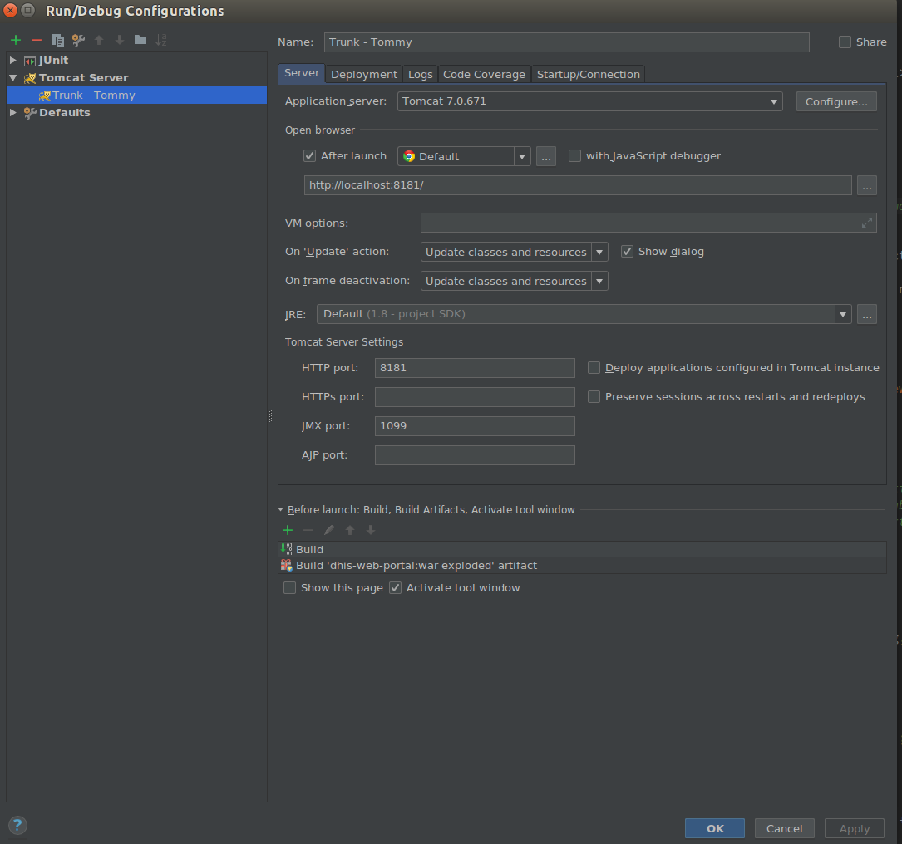
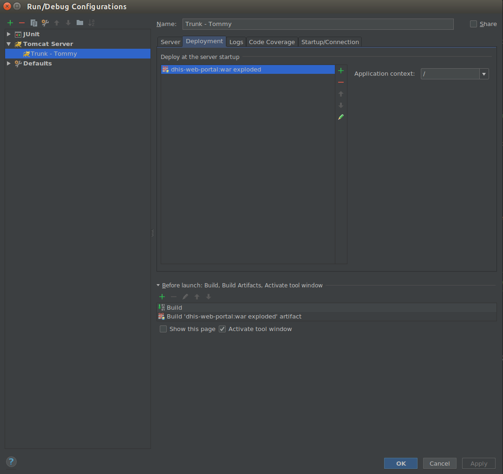

# HotSwap using IntelliJ

Hotswap will update changes to class and javascript files on run time without having to restart Tomcat.
Step1.

Step2 

## Things to remember

1. These settings will only take effect if IntelliJ is run in ***DEBUG*** mode.
2. Any change which involve modification in signrature of the class will ***NOT*** trigger Hotswap
