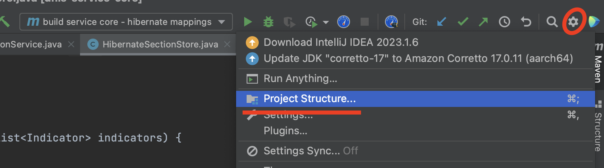
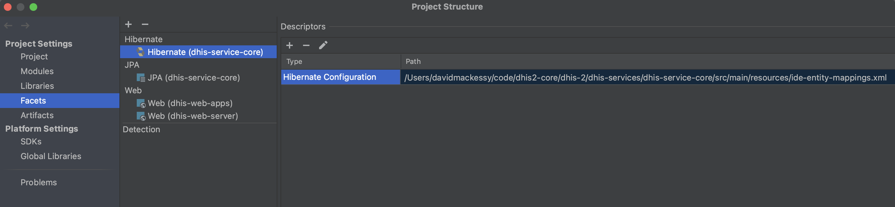

# Enable HQL Entity detection in IntelliJ
We use Hibernate as our ORM, using mapping files (`.hbm.xml`) to define the entities. IntelliJ provides the ability to detect valid Entities (and properties) when writing `HQL`. This guide will go through those steps to set this up.

## Previously, with no Entity detection
`HQL` looks like this in IntelliJ:  
(a) `Section` entity is not recognised as a valid Entity  
(b) `s.dataElementsss` is not detected to be invalid (misspelling)  
(c) There are no Entity property suggestions when using dot notation on the variable  

  

## Enabling Entity detection
### 1. Create new file
Put the [below xml](#xml-for-file) in a new file called `ide-entity-mapping.xml` (file can be any name).  

### 2. Put new file in project
Put the new file in the `dhis-service-core` module in directory `src/main/resources`, where our mappings exist.  

### 3. Open the project structure window in IntelliJ  
     


### 4. Add a new Hibernate facet in IntelliJ
Add a new hibernate facet in IntelliJ, selecting the new `ide-entity-mappings.xml` file 
   

### 5. Observe new behaviour
Build the `dhis-service-core` module (so jar is available) to enable detection, noting the new abilities:  
   (a) The `Section` entity is now detected by the IDE  
   (b) The `s.dataElementsss` property shows as invalid (misspelled)  
   (c) Valid properties are shown as if using Java   
        

## Other info
This is just purely to provide a link from the mapping files for the IDE. We configure the persistence layer programmatically (also loading the mapping files), so this won't interfere with that process.  
We do plan on moving to annotation-based mapping in the future. If this stops working then we can look into a new configuration for this behaviour.  
The `jar` mapping was selected for ease of use. We have over a hundred mapping files (didn't want to list them individually). Any new mappings will be automatically included in the `jar`.

## XML for file
```xml
<?xml version='1.0' encoding='utf-8'?>
<!DOCTYPE hibernate-configuration PUBLIC
  "-//Hibernate/Hibernate Configuration DTD//EN"
  "http://www.hibernate.org/dtd/hibernate-configuration-3.0.dtd">

<!--
  This file exists purely to provide a link from the hibernate .hbm Entity mappings to
  the IDE, which enables the following IDE perks in HQL queries:
    - automatic property detection for Entity types
    - warning for incorrect Entity type or Entity property

  The mapping type used is jar, so the 'dhis-service-core' module requires building in order
  for the jar to be available for mapping.
-->
<hibernate-configuration>
  <session-factory>
    <mapping jar="../../dhis-service-core-2.42-SNAPSHOT.jar"/>
  </session-factory>
</hibernate-configuration>
```