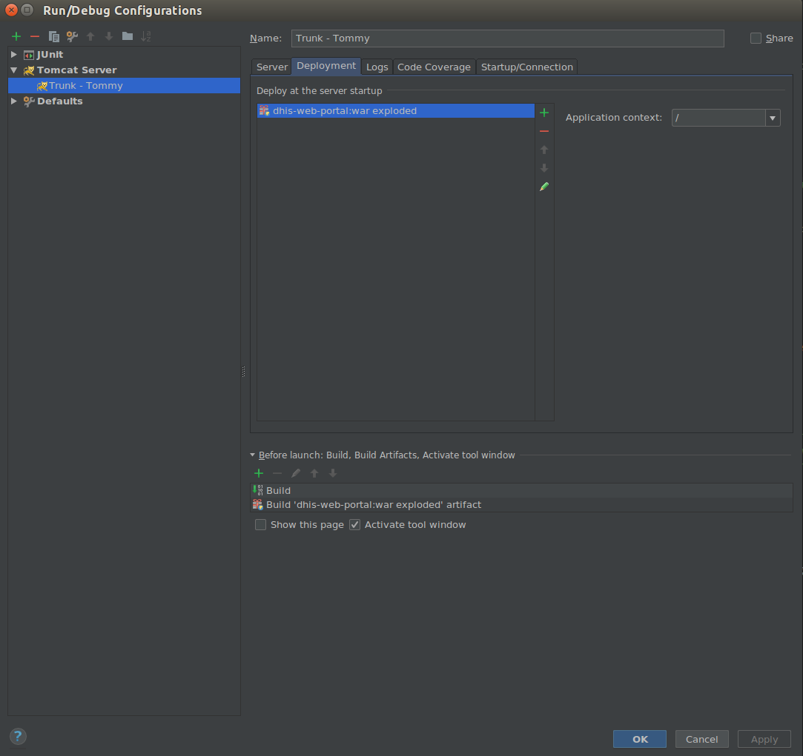

# IntelliJ IDEA Project Setup Guide

Follow these detailed steps to set up your project in IntelliJ IDEA seamlessly:

1. Build with Maven. Run the following commands from the command line:
    - `mvn clean install -f dhis-2/pom.xml -DskipTests=true`
    - `mvn clean install -f dhis-2/dhis-web/pom.xml -DskipTests=true`

2. Import Project to IntelliJ:
    - Continue by importing the project from your local sources into IntelliJ.

3. Add as Maven Project:
    - Right-click on the project's pom.xml and select "Add as Maven Project".

4. Configure Maven Projects:
    - In the plugin list on the right side, click on Maven.
    - Add the web portal project to the list of Maven projects.
    - Make sure it's part of the list of modules in `/File/Project Stucture/Modules`. If it's not, add it to the list.

5. Configure Local Tomcat:
    - Open the configurations menu and add a new local Tomcat configuration.
    - In the _Deployment_ tab, add the artifact named _dhis-web-portal:war exploded_. This will automatically select this artifact for build before launch. 

6. Configure Tomcat Settings:
    - Navigate to the _Server_ tab.
    - Choose an available port in your local URL.
    - In both options _on update action_ and _on frame deactivation_, select _update classes and resources_ if you need to enable hot swap functionality.

7. Set Environment Variable:
    - In the _Startup/Connection_ tab, add a new environment variable called ***DHIS2_HOME***. Repeat this action for the Debug profile too.
    - Set the value to your configuration file.

8. Configure Logging (optional):
    - Go to the _Logs_ tab and click on Save console output to file.
    - Choose a file, preferably the Catalina file of your local Tomcat, to store logs.