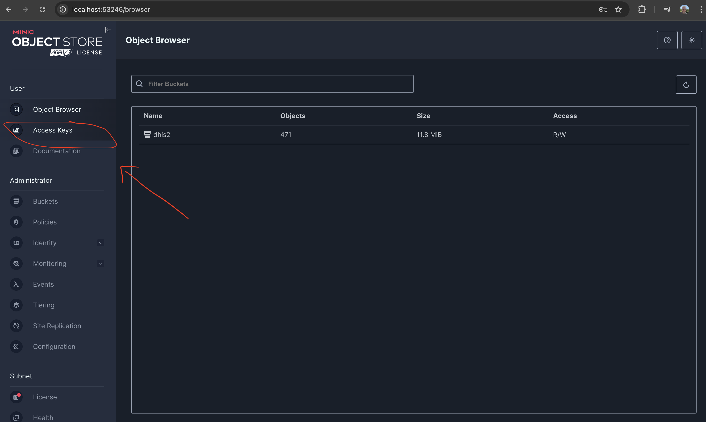
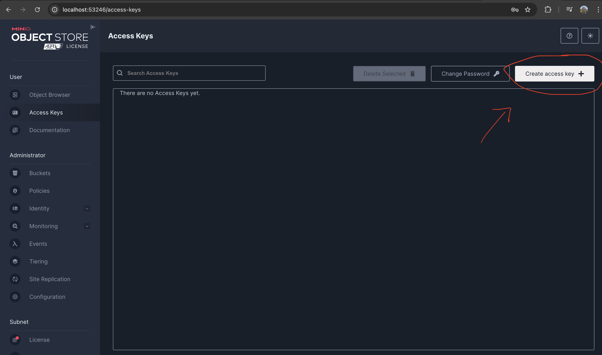
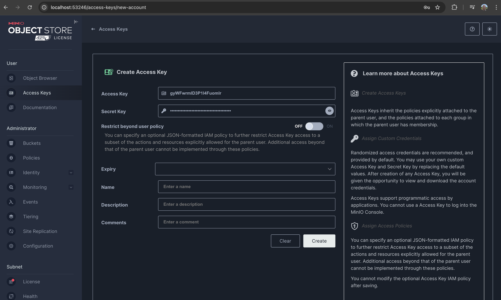
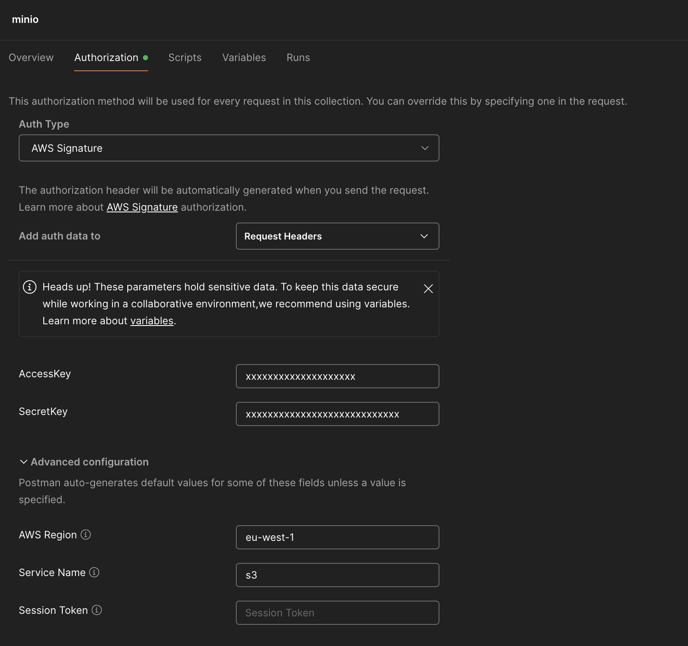

# Local DHIS2 with MinIO storage

DHIS2 allows different types of storage: 
- file system (local storage)
- s3 (any s3-compatible storage)
- aws-s3 (aws cloud storage) 

This guide will walk through running a local DHIS2 with local MinIO storage.

## Install MinIO 
The full guide is available for different platforms [here](https://min.io/docs/minio/macos/index.html). For mac, run  
`brew install minio/stable/minio`

## Run MinIO
Running the following command will start the MinIO server and use the directory provided for storage (in this example `user1` is the logged in user).  
`minio server /Users/user1/minio/storage`  

The following logs should be shown, which outline the default auth credentials and the URLs the API and UI are available on.
```text
MinIO Object Storage Server
Copyright: 2015-2025 MinIO, Inc.
License: GNU AGPLv3 - https://www.gnu.org/licenses/agpl-3.0.html
Version: RELEASE.2024-07-10T18-41-49Z (go1.22.5 darwin/arm64)

API: http://192.168.1.238:9000  http://127.0.0.1:9000 
   RootUser: minioadmin 
   RootPass: minioadmin 

WebUI: http://192.168.1.238:53246 http://127.0.0.1:53246             
   RootUser: minioadmin 
   RootPass: minioadmin 

CLI: https://min.io/docs/minio/linux/reference/minio-mc.html#quickstart
   $ mc alias set 'myminio' 'http://192.168.1.238:9000' 'minioadmin' 'minioadmin'

Docs: https://min.io/docs/minio/linux/index.html
Status:         1 Online, 0 Offline. 

```

Open the browser using the URL provided (http://127.0.0.1:53246 above) and login with the credentials above.

## Create access credentials
Cick on the `Access Keys` section  


Click `Create access key`  


Take a note of the access and secret keys and then click `Create`, these are needed for DHIS2 config.


## DHIS2 config
Next, we need to set the file storage config in the `dhis.conf` file. The `access key` should be used as the `filestore.identity` value. The `secret key` should be used as the `filestore.secret` value. The following config can be used. The `filestore.endpoint` value should be the value shown in the logs after starting MinIO. 
```text
filestore.provider = s3
filestore.container = dhis2
filestore.location = eu-west-1
filestore.endpoint = http://localhost:9000
filestore.identity = xxxxxxxxxxxxxx
filestore.secret = xxxxxxxxxxxxxxxxxxxx
```

With this config in place, the following endpoint should now be available locally:  
`localhost:9000/dhis2`  

> **Note**
>
> If calling the MinIO endpoint with a client (like Postman), you will need to setup the correct authentication. See screenshot below. A successful call to http://localhost:9000 will then confirm the credentials are correct.   



## Start DHIS2
With MinIO running and the `dhis.conf` updated, start DHIS2 as you would normally. Along with other logs, you should see something like this which confirms that s3 storage is in use:  
```text
13:46:52.859  INFO [main] o.h.d.j.JCloudsStore : File store configured with provider: 's3', container: 'dhis2' and location: 'eu-west-1'.
```
